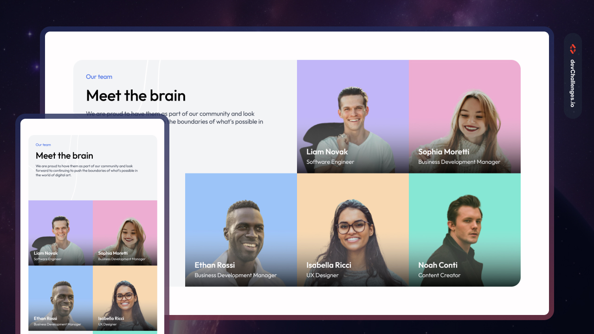

<!-- Please update value in the {}  -->

<h1 align="center">Meet the Team | devChallenges</h1>

   Solution for a challenge <a href="https://devchallenges.io/challenge/meet-the-team-section-challenge" target="_blank">Meet the Team Section</a> from <a href="http://devchallenges.io" target="_blank">devChallenges.io</a>.

  <h3>
    <a href="https://mlvoorhis.github.io/our-team-layout-master/">
      Demo
    </a>
     | 
    <a href="https://github.com/mlvoorhis/our-team-layout-master">
      Solution
    </a>
     | 
    <a href="https://devchallenges.io/challenge/meet-the-team-section-challenge">
      Challenge
    </a>
  </h3>

<!-- TABLE OF CONTENTS -->

## Table of Contents

- [Overview](#overview)
- [What I learned](#what-i-learned)
- [Built with](#built-with)
- [Features](#features)
- [Contact](#contact)

<!-- OVERVIEW -->

## Overview

This layout applies a range of modern CSS techniques to create a clean, responsive, and visually layered design. I used attribute selectors to target elements efficiently, CSS Grid and Flexbox for structured layouts and alignment, and media queries to adapt the layout across different screen sizes. I also implemented relative and absolute positioning to layer content and decorative elements with precision. Pseudo-elements were used to add backgrounds and visual enhancements without additional HTML. Accessibility was considered by using semantic HTML, maintaining proper color contrast, and ensuring content remains readable and navigable across devices.

### What I learned

- This project strengthened my understanding of positioning in CSS. I practiced using <code>position: absolute</code> in conjunction with a relatively positioned ancestor to precisely layer elements within their containers. I used <code>::before</code> pseudo-elements to add decorative backgrounds without extra HTML, and managed stacking with <code>z-index</code> to ensure content remained readable and visually organized. Working with <code>background-position</code> helped me control placement without stretching images, and I spent time troubleshooting square box sizing with <code>aspect-ratio</code> and container sizing.
- I used <code>overflow: hidden</code> on my container so images would not override border-radius. 
- A valuable reminder from this project was the importance of case sensitivity in file names—an initial 404 error turned out to be a capitalization mismatch. 

### Built with
- Semantic HTML5 markup
- CSS custom properties
- Flexbox
- CSS Grid

## Features

This application/site was created as a submission to a [DevChallenges](https://devchallenges.io/challenges-dashboard) challenge.

## Contact

- GitHub [@mlvoorhis](https://github.com/mlvoorhis)
